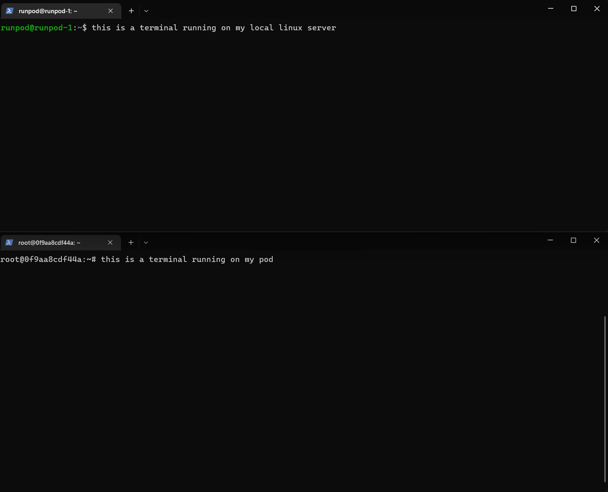

<div align="center">

# RunPod CLI

</div>

runpodctl is a CLI tool to automate / manage GPU pods for [runpod.io](https://runpod.io).

**Please note that there is a breaking change in 1.8.0 that is incompatible with previous versions. You can check your version by typing**
```
runpodctl version
```

*Note: All pods automatically come with runpod cli installed with a pod-scoped API key.*

## Get Started

### Install (linux/osx)

```bash
#wget
wget cli.runpod.io | sudo bash

```

or

```bash
#brew
brew tap runpod/runpod
brew install runpod
```

## Install (Windows PowerShell)

```cmd
wget https://github.com/runpod/runpodctl/releases/download/v1.9.0/runpodctl-win-amd -O runpodctl.exe
```

### Tutorial

Please checkout this [video tutorial](https://www.youtube.com/watch?v=QN1vdGhjcRc) for a detailed walkthrough of runpod cli.

**Video Chapters:**

[Installing runpod cli latest version to transfer files between Pods and PC](https://www.youtube.com/watch?v=QN1vdGhjcRc&t=1384s)

[Uploading thousands of images (big data) from your computer to RunPod via runpod cli](https://www.youtube.com/watch?v=QN1vdGhjcRc&t=2068s)

[Sending files from your PC to RunPod via runpod cli](https://www.youtube.com/watch?v=QN1vdGhjcRc&t=2106s)

[Downloading a folder from RunPod to your PC via runpod cli](https://www.youtube.com/watch?v=QN1vdGhjcRc&t=2549s)

[Adding runpod cli to environment path to use from every folder](https://www.youtube.com/watch?v=QN1vdGhjcRc&t=2589s)

[Downloading your trained model files (ckpt) into your PC via runpod cli](https://www.youtube.com/watch?v=QN1vdGhjcRc&t=4871s)



## Transferring Data (file send/receive)

Using send or receive command does not require API keys due to built-in security of one-time codes.

Run the following on the computer that has the file you want to send

```bash
runpod file send data.txt
```

The command should output something like

```bash
Sending 'data.txt' (5 B)
Code is: 8338-galileo-collect-fidel
On the other computer run

runpod file receive 8338-galileo-collect-fidel
```

Run the following on the computer that you want to send the file to

```bash
runpod file receive 8338-galileo-collect-fidel
```

It should start transferring with output that looks like

```
Receiving 'data.txt' (5 B)

Receiving (<-149.36.0.243:8692)
data.txt 100% |████████████████████| ( 5/ 5B, 0.040 kB/s)
```

<br />


<br />

# Using google drive

You can use the following links for google colab

[Send](https://colab.research.google.com/drive/1UaODD9iGswnKF7SZfsvwHDGWWwLziOsr#scrollTo=2nlcIAY3gGLt)

[Receive](https://colab.research.google.com/drive/1ot8pODgystx1D6_zvsALDSvjACBF1cj6#scrollTo=RF1bMqhBOpSZ)

# Pod Commands

Visit [docs](doc/runpodctl.md) for details of all commands.

First configure the API key. You can get API key from [runpod](https://runpod.io/console/user/settings).

```bash
# Configure API key
runpod config --apiKey={key}

# Create a pod
runpod pod create

# Start a pod
runpod pod start {podId}

# Stop a pod
runpod pod stop {podId}
```

Get all pods:
```
runpodctl get pod
```
Get a pod:
```
runpodctl get pod {podId}
```
Start an ondemand pod.
```
runpodctl start pod {podId}
```
Start a spot pod with bid. The bid price you set is the price you will pay if not outbid:
```
runpodctl start pod {podId} --bid=0.3
```

## Dockerless

```bash
# Configure API key
runpod config --apiKey={key}

# Create a new worker
runpod worker new
cd {worker name}

# Start a worker
runpod worker start {workerId}

# Deploy a worker
runpod worker deploy
```

## thanks to

- [cobra](https://github.com/spf13/cobra)
- [croc](https://github.com/schollz/croc)
- [golang](https://go.dev/)
- [nebula](https://github.com/slackhq/nebula)
- [viper](https://github.com/spf13/viper)
